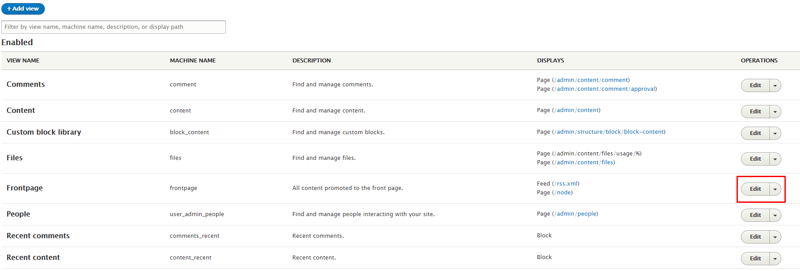
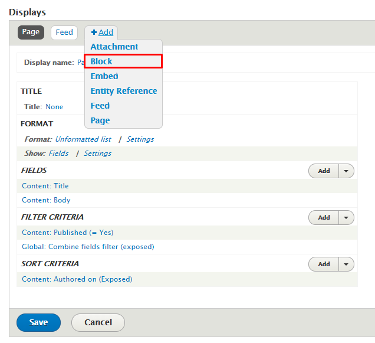
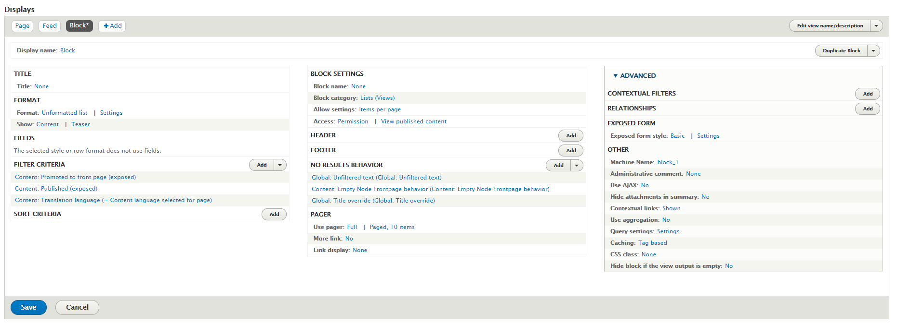
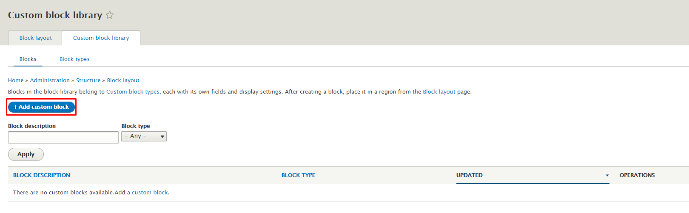
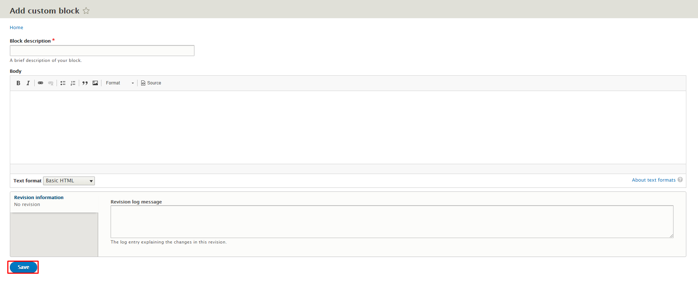

# Drupal Block

### 1. Khái niệm Block

* Block là một khối nội dung được hiển thị trong một vùng của website \(VD: Menu, Banner, Tin tức...\).
* Block được tạo ra từ module Block, nằm trong core của Drupal.

### 2. Cách tạo Block

Block có thể được tạo ra từ View,  hoặc cũng có thể tạo ra một custom block tùy theo nhu cầu.

#### 2.1 Tạo Block từ View

Truy cập vào Views: Từ thanh Menu &gt; Structure &gt; Views &gt; Chọn view cần tạo Block \(Ở đây ví dụ là View Frontpage\) &gt; Chọn "Edit"



Click chọn "Add" &gt; Chọn "Block"



Cấu hình Block



Chọn "Save" để lưu view

#### 2.2 Tạo custom block bằng giao diện quản lí

Chọn "Structure" &gt; "Block layout" &gt; "Custom block library" &gt; Chọn "Add custom block"



Điền các field tương ứng



Chọn "Save"

#### 2.3 Tạo custom block trong module custom

Tạo folder module tên là "custom\_block" và đặt module này trong folder "modules/custom" của thư mục root

Tạo file "HelloBlock.php" và đặt vào trong folder "custom\_block" theo đường dẫn "src/Plugin/Block/HelloBlock.php"

Chèn đoạn code này vào bên trong file 

```php
<?php
namespace Drupal\hello_world\Plugin\Block;
use Drupal\Core\Block\BlockBase;

/**
 * Provides a 'Hello' Block.
 *
 * @Block(
 *   id = "hello_block",
 *   admin_label = @Translation("Hello block"),
 *   category = @Translation("Hello World"),
 * )
 */
class HelloBlock extends BlockBase {

  /**
   * {@inheritdoc}
   */
  public function build() {
    return [
      '#markup' => $this->t('Hello, World!'),
    ];
  }
}
```

Sau đó vào Drupal và xóa Cache

### 3. Setting hiển thị cho block

