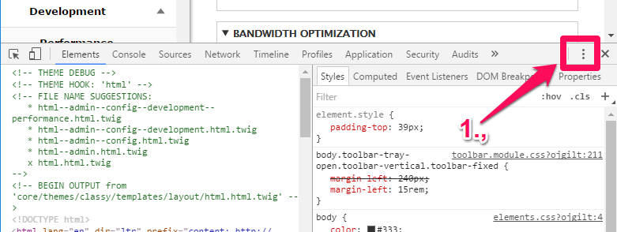
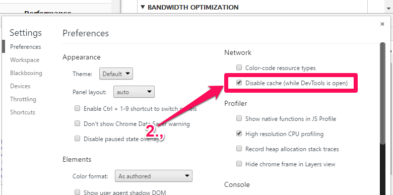

# Drupal Cache

## Cache API: 

### Định nghĩa: 

1 cache là 1 thành phần thuộc phần cứng hay phần mềm có chứa dữ liệu, nhằm mục đích tăng tốc độ xử lý dữ liệu đó khi nó được gọi tới. Dữ liệu trong 1 cache có thể là kết quả của việc tính toán trước đó, hoặc là 1 bản sao dữ liệu được lưu ở đâu đó.

### Cache hit, cache miss:

Cache hit: xảy ra khi dữ liệu được gọi có thể được tìm thấy trong cache, trong khi ngược lại thì gọi là cache miss. Dữ liệu khi cache hit sẽ được lấy ra từ cache, điều này nhanh hơn việc tính toán kết quả 1 lần nữa hoặc lấy dữ liệu ra từ nơi khác. Vì thế, càng nhiều dữ liệu được gọi ra từ cache, thì hệ thống càng xử lý nhanh hơn. Cache API trong drupal 8 chứa các dữ liệu mất thời gian để tính toán.

### Xử lý dữ liệu cache:

Cách dữ liệu được lưu trữ vào các backend và bin:

* Khi xử lý 1 request HTTP, thông tin được lưu trong các bin khác nhau, mỗi bin này được lưu trữ trong các backend.
* Backend là 1 cơ chế lưu trữ: database SQL, Memcache, thậm chí là các file trong ổ đĩa.
* Khi request 1 cache object, có thể tùy chỉnh tên của bin khi gọi đến \Drupal::cache\(\).

Hoặc, có thể request 1 bin bằng việc get service “cache.nameofbin” từ container. Bin mặc định được đặt là “default”, với tên service là “cache.default”, dùng để lưu trữ các dữ cache hay được sử dụng.

1 module có thể tự định nghĩa cache bin cho riêng nó trong file modulename.services.yml như sau\]

```text
cache.nameofbin:
 class: Drupal\Core\Cache\CacheBackendInterface
 tags:
   - { name: cache.bin }
 factory: cache_factory:get
 arguments: [nameofbin]
```

Một vài cache bin hay dùng: bootstrap, render,data, discovery

### Bin

Được map đến các bảng trong db có tiền tố cache\_ . Khi tương tác với cache, ta luôn bắt đầu bằng việc request 1 bin:

```text
$cache = \Drupal::cache();
```

$cache là instance của 1 object DatabaseBackend đại diện cho bin mặc định \( cache\_default\). Để yêu cầu 1 bin cụ thế, ta truyền tên bin vào constructor:

```text
$render_cache = \Drupal::cache('render');
```

Lấy ra các cache:

```text
$cache = \Drupal::cache()->get('my_value');
```

$cache là 1 object stdClass chứa metadata + với dữ liệu thật trong $cache-&gt;data. Tham số my\_value là cache ID

Lưu lại 1 cache:

Sử dụng method set\(\), method này cần 2 tham số bắt buộc và 2 tham số lựa chọn:

* Cache ID
* Dữ liệu \(có thể là 1 chuỗi, mảng\)
* Thời gian tồn tại cache
* Tag

Ví dụ:

```text
Drupal::cache()->set('my_value', $my_object, CacheBackendInterface::CACHE_PERMANENT, array('my_first_tag', 'my_second_tag'));
```

**Xóa và vô hiệu hóa cache**‌

Cache có thể bị xóa bằng việc dùng method garbageCollection\(\). Khi 1 chace hết hạn tồn tại, cache này bị coi là vô hiệu nhưng vẫn tồn tại trong bin và có thể được lấy ra. Ta có thể vô hiệu chúng bằng các method invalidate\(\), invalidateMultiple\(\) hoặc invalidateAll\(\). Có thể xóa bằng method delete\(\), deleteMultiple hoặc deleteAll\(\) , điều này sẽ xóa các bản ghi liên quan đến cache bị xóa trong db‌

### Cache Properties <a id="cache-properties"></a>

‌

1 cache có 3 properties là context, tags, max-age.

```text
'#cache' => [    'contexts' => ['languages', 'timezone'],    'tags' => ['node:5', 'user:3'],    'max-age' => Cache::PERMANENT,    ],
```

‌

#### Tag <a id="tag"></a>

‌

 Dùng để nhận dạng các cache items trong nhiều bin khác nhau. Mục đích của tag là để chỉ định 1 cách chính xác các cache item giống data với nhau.‌

#### Context <a id="context"></a>

‌

 Cache context là cái gì đó cho phép bộ nhớ đệm của sự thay đổi khác nhau của một cái gì đó \(ví dụ nội dung hoặc kết quả của một số phức tạp, thời gian dài / tài nguyên tính toán\). Cache context tương tự như [HTTP-Vary](https://www.w3.org/Protocols/HTTP/Issues/vary-header.html)\(các thay đổi của bộ nhớ cache\). Theo định nghĩa [D.O](http://www.drupal.org/).

> > “Cache contexts provide a declarative way to create context-dependent variations of something that needs to be cached.”

‌

Những gì tôi phát hiện ra trong quá trình tra cứu cache context là một điều tổng quát. Bởi vì tổng quát có nghĩa là bất kỳ thông tin có sẵn hoặc có thể nhận được trên mọi yêu cầu như thông tin người dùng, IP, session, vv . Nếu cái gì đó không phải là toàn cầu hoặc không thể xác định trong mỗi yêu cầu, chúng tôi không thể sử dụng nó cho bối cảnh bộ nhớ cache \(một lần nữa AFAIK\) . Một ví dụ là thông tin nút hoặc thông tin trường nút. Chúng ta không thể có / lấy thông tin về một nút trên mọi yêu cầu và do đó không thể sử dụng nó như là bối cảnh bộ nhớ cache \(một lần nữa AFAIK\), mặt khác chúng ta hãy lấy ví dụ về người dùng. Chúng tôi có thông tin người dùng có sẵn trên toàn cầu \(cho mỗi yêu cầu\) và do đó chúng tôi có thể sử dụng nó trong cache context. Tương tự phiên, cookie, IP là một cái gì đó mà chúng tôi có trên mọi yêu cầu và do đó có thể được sử dụng cho cache context.‌

Hãy thảo luận về trường hợp sử dụng cache context. Một khách hàng muốn hiển thị vai trò của người dùng hiện tại trong một khối. Để đơn giản, chúng tôi giả định rằng một vai trò có thể được gán cho người dùng \(ngoại trừ vai trò được chứng thực\). Trong Drupal 7, điều này có thể được thực hiện dễ dàng. Nhưng khách hàng cũng muốn bộ nhớ đệm đúng . Đây là điều khó khắn. Trong Drupal 7, chúng tôi có cấp độ trang và bộ nhớ đệm cấp khối. Bộ nhớ đệm cấp trang chỉ hoạt động cho người dùng ẩn danh, do đó, bộ nhớ đệm cấp độ chặn là lựa chọn duy nhất của chúng tôi, nhưng vấn đề với bộ nhớ đệm cấp độ khối là nó không cung cấp biến thể. Nó sẽ cache khối cho lần truy cập đầu tiên của người dùng và hiển thị cùng một dữ liệu với người khác \(không quan tâm nếu người dùng có vai trò khác nhau\).‌

Drupal 8 có giải pháp trong xây dựng cho các vấn đề trên \(cache ngữ cảnh \). Drupal 8 lõi cung cấp bối cảnh bộ nhớ cache user.roles cho phép thay đổi bộ nhớ cache dựa trên vai trò người dùng. Vì vậy, nếu người dùng có vai trò 'A' xuất hiện lần đầu tiên, khối sẽ được lưu trữ. Lần thứ hai nếu cùng / người dùng khác nhau có vai trò 'A' đến, phiên bản đã lưu trong bộ nhớ cache sẽ được phục vụ. Nếu người dùng khác có vai trò 'B' xuất hiện, thì phiên bản được lưu trữ trong bộ nhớ cache sẽ được phục vụ. Lần thứ hai đối với người dùng có vai trò 'B', phiên bản đã lưu trong bộ nhớ cache sẽ được sử dụng.

#### Max-age

Tính bằng giây, max-age kiểm soát thời gian tồn tại của 1 cache.

#### Xóa cache trên drupal

Có 3 cách:

* Dùng giao diện admin: vào URL _admin/config/development/performance, chọn clear all cache_
* Dùng script rebuild: mở file setting.php, thêm đoạn code này vào cuối file:

```text
$settings['rebuild_access'] = TRUE;
```

Sau đó truy cập vào /core/rebuild.php

* Dùng console: drush cache-rebuild

#### Các module hỗ trợ cache:

* Internal Page Cache: Cache các trang web cho người dùng ẩn danh, cải thiện đáng kể performance của trang. Tuy nhiên module này cần được vô hiệu hóa trên các website cung cấp 1 vài  nội dung  cá nhân cho người dùng ẩn danh.
* Dynamic Page Cache: Chức năng giống module trên nhưng có thêm các cải tiến. Cache của module này không chỉ hoạt động với user  ẩn danh mà còn với user đã log in. Trang web sẽ được cache trừ các content cá nhân của nó.

#### 1 vài câu lệnh setting về cache:

```text
-	<?php
-	 
-	// Set an expiring cache item
-	\Drupal::cache()-&gt;set('cache_key', 'cache_data', $expiration_timestamp);
-	 
-	// Set a permanent cache item
-	\Drupal::cache()-&gt;set('cache_key', 'cache_data', CacheBackendInterface::CACHE_PERMANENT);
-	 
-	// Set a permanent cache item with tags.
-	\Drupal::cache()-&gt;set('cache_key', 'cache_data', CacheBackendInterface::CACHE_PERMANENT, array('tag_one', 'second_tag'));
-	 
-	// Fetch an item from the cache
-	$cache = \Drupal::cache()-&gt;get('cache_key');
-	if (!empty($cache-&gt;data) {
-	  // Do something with $cache-&gt;data here.
-	}
-	 
-	// Invalidate a cache item
-	\Drupal::cache()-&gt;invalidate('cache_key');
-	 
-	// Invalidate multiple cache items
-	\Drupal::cache()-&gt;invalidateMultiple($array_of_cache_ids);
-	 
-	// Invalidate specific cache tags
-	use Drupal\Core\Cache\Cache;
-	 
-	Cache::invalidateTags(['config:block.block.YOURBLOCKID', 
-	  'config:YOURMODULE.YOURCONFIG', 'node:YOURNID']);
-	 
-	// Note that the invalidation functions also exist for deleting caches,
-	// by just replacing invalidate with delete.
-	 
-	// Flush the entire site cache.
-	drupal_flush_all_caches();

```

### ​Vô hiệu hóa cache trong Drupal 8

Vô hiệu hóa cache \(cache render, cache các page động, cache file Twig\) trong quá trình code có ích trong việc kiểm tra các thay đổi do code mà không phải xóa cache.

Nếu như terminal nhìn giống hình dưới:

```text
$ drush cr
Cache rebuild complete.                      [ok]
$ drush cr
Cache rebuild complete.                      [ok]
$ drush cr
Cache rebuild complete.                      [ok]

...
```

thì hãy thử các cách sau \( **lưu ý**: **bắt buộc phải log in user để xem trang web với chế độ cache bị vô hiệu hóa\)**

**Cách 1: Bật local development settings**

1. Copy, sửa tên và di chuyển file sites/example.settings.local.php vào file sites/default/settings.local.php

```text
$ cp sites/example.settings.local.php sites/default/settings.local.php
```

   2. Mở file settings.php trong thư mục sites/default và uncomment các dòng sau:

```text
if (file_exists($app_root . '/' . $site_path . '/settings.local.php')) {
  include $app_root . '/' . $site_path . '/settings.local.php';
}
```

Mục đích là để enable file local setting như 1 phần của file settings.php

   3. Mở file settings.local.php và enable file development.services.yml

```text
$settings['container_yamls'][] = DRUPAL_ROOT . '/sites/development.services.yml';
```

theo mặc định development.services.yml chứa các settings có thể vô hiệu hóa Drupal cache:

```text
services:
  cache.backend.null:
    class: Drupal\Core\Cache\NullBackendFactory
```

**LƯU Ý: không tạo file development.services.yml, file này đã xuất hiện dưới thư mục /sites**

  4. Trong file settings.local.php chuyển các setting sau thành true nếu muốn enable css-aggregation và js-aggregation:

```text
$config['system.performance']['css']['preprocess'] = FALSE;
$config['system.performance']['js']['preprocess'] = FALSE;
```

  5. Uncomment các dòng sau trong file settings.local.php để vô hiệu hóa render cache và cache các page động:

```text
$settings['cache']['bins']['render'] = 'cache.backend.null';
$settings['cache']['bins']['dynamic_page_cache'] = 'cache.backend.null';
```

Nếu version drupal đang dùng lớn hơn  8.4 thì thêm dòng sau vào file settings.local.php

```text
$settings['cache']['bins']['page'] = 'cache.backend.null';
```

  6. Mở file development.services.yml và thêm đoạn code sau để vô hiệu hóa Twig cache:

```text
parameters:
  twig.config:
    debug: true
    auto_reload: true
    cache: false
```

Lưu ý: nếu block parameters đã tồn tại, chỉ việc thêm block twig.config vào thôi

  7. Sau đó ta phải rebuild lại Cache nếu không trang web sẽ bị lỗi khi tải trang.

File development.services.yml sẽ thành như sau:

```text
# Local development services.
#
# To activate this feature, follow the instructions at the top of the
# 'example.settings.local.php' file, which sits next to this file.
parameters:
  http.response.debug_cacheability_headers: true
  twig.config:
    debug: true
    auto_reload: true
    cache: false
services:
  cache.backend.null:
    class: Drupal\Core\Cache\NullBackendFactory
```

**Cách 2: sử dụng Drupal Console**

Dùng lệnh console sau:

```text
drupal site:mode dev
```

Command này sẽ đè lên các giá trị setting của file services.yml và trên màn hình console sẽ chỉ ra các thay đổi trong setting:

```text
$ drupal site:mode dev
 Configuration name: system.performance
 ------------------------- ---------------- ----------------
  Configuration key         Original Value   Override Value
 ------------------------- ---------------- ----------------
  cache.page.use_internal                    false
  css.preprocess            true             false
  css.gzip                  true             false
  js.preprocess             true             false
  js.gzip                   true             false
  response.gzip                              false
 ------------------------- ---------------- ----------------

 Configuration name: views.settings
 -------------------------------- ---------------- ----------------
  Configuration key                Original Value   Override Value
 -------------------------------- ---------------- ----------------
  ui.show.sql_query.enabled        false            true
  ui.show.performance_statistics   false            true
 -------------------------------- ---------------- ----------------

 Configuration name: system.logging
 ------------------- ---------------- ----------------
  Configuration key   Original Value   Override Value
 ------------------- ---------------- ----------------
  error_level         hide             all
 ------------------- ---------------- ----------------


 Services files C:\xampp5628\htdocs\d825/sites/default/services.yml was
 overwritten


 New services settings
 ------------- ------------- -------
  Service       Parameter     Value
 ------------- ------------- -------
  twig.config   auto_reload   true
  twig.config   cache         true
  twig.config   debug         true
 ------------- ------------- -------

 cache:rebuild

 Rebuilding cache(s), wait a moment please.


 [OK] Done clearing cache(s).

$
```

**Lưu ý:**

* Không kích hoạt file local.settings.php trong file settings.php
* Dùng lệnh drupal site:mode prod để revert lại

**Cách 3: tìm các cache bin**

Các lệnh tìm cache bin:

```text
find . -type f -name *.services.yml | \
xargs sed -E -n  's/.*cache\.(.*):.*/\1/p' | \
grep -v "backend\|html.twig" | \
sort -u | \
awk -vORS=\',\' '{ print $1 }' | \
sed "s/,'$//" | sed "s/^/'/"
```

Lưu ý trên môi trường OSX ta cần cài gawk và chạy 'gawk' thay cho 'awk' .

Sau đó copy/paste tên các bin vào file settings.php  như sau

```text
$cache_bins = array('bootstrap','config','data','default','discovery','dynamic_page_cache','entity','menu','migrate','render','rest','static','toolbar');
foreach ($cache_bins as $bin) {
  $settings['cache']['bins'][$bin] = 'cache.backend.null';
}
```

**Cách 4: Vô hiệu hóa cache dùng trình duyệt**

 Sau khi tắt cache trên các file setting, những thay đổi CSS vẫn có thể không được áp dụng ngay trên trình duyệt. Mặc dù drupal có thể không lưu cache, nhưng trên trình duyệt web vẫn có lưu. Có thể vô hiệu hóa như sau \( trình duyệt Chrome\):





Hoặc khi refresh trang có thể dùng tổ hợp CTRL  + F5. 


