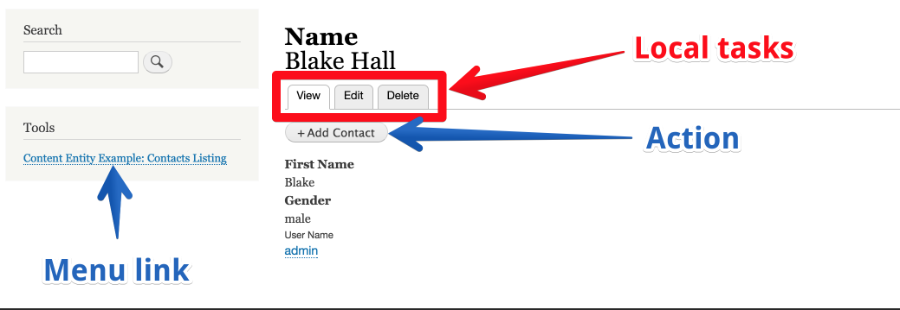

# Drupal Entity

### Định nghĩa 

Entity là các class được gắn với nhiều phương thức 

| Phương thức chung | $entity-&gt;id\(\) |
| :--- | :--- |
| Phương thức riêng của 1 kiểu entity | $node-&gt;getTitle\(\) |

Entity của core được chia làm 2 biến thể

### Các biến thể của entity

#### Configuration Entity

Được sử dụng bởi Configuration System. Hỗ trợ biên dịch và có thể cung cấp các mặc định tùy chỉnh cho việc cài đặt. Configuration entity được lưu trữ trong các hàng của bảng config trong db.

#### Content Entity

Bao gồm các base field có thể cấu hình được, có thể có các revision và hỗ trợ biên dịch. Content entity được lưu trữ trong các hàng của 1 bảng cơ sở dữ liệu tùy chỉnh. Tên của bảng có thể giống với id của content entity, và các cột được định nghĩa bởi phương thức "baseFieldDefinitions" của entity.

### Các thuật ngữ chính của entity API

#### Bundle

Bundle là 1 biến thể khác của 1 entity type. Ví dụ, với entity type là node, các bundle là các node type khác nhau, ví dụ như 'article' và 'page'.

#### Field

Field bao gồm các thành phần dữ liệu định nghĩa nên các chi tiết của 1 mô hình dữ liệu. VD: nếu muốn xây dựng 1 image gallery, node type của bạn sẽ cần phương thức thu thập các image =&gt; cần có 1 field image 

#### Plugin

Các plugin cung cấp cho dev 1 API để đóng gói lại các hành vi có thể tái sử dụng . Các plugin có thể được sử dụng xuyên suốt Drupal core và bạn có thể được tiếp cận với 1 vài plugin này khi làm việc với Entity API. 

#### Annotation

Annotation là 1 thành phần khác của Entity API. Annotation nôm na nó chỉ là mấy dòng comment code thôi :D  


#### Handler

### Sự khác nhau đối với entity giữa drupal 7 và 8

#### In ra giá trị của 1 field:

Drupal 7..

```text
print $node->field_name[LANGUAGE_NONE][0]['value'];
```

Drupal 8..

```text
print $node->field_name->value;
$author_name = $node->uid->entity->name->value;
```

#### Getting a field definition

Drupal 7..

```text
$node->field_name[LANGUAGE_NONE][0]['value'] = 'Hello world';
$node->save();
```

Drupal 8..

```text
$node->field_name->value = 'Hello world';
$node->save();
```

### Các loại entity trong drupal core

Dưới đây là hình ảnh mô tả phân cấp class của core và mô tả các kiểu entity


Từ hình trên ta có thể thấy configuration entity extend class `\Drupal\Core\Config\Entity\ConfigEntityBase trong khi content entity extend class \Drupal\Core\Entity\ContentEntityBase. Cả 2 base class này extend Drupal\Core\Entity\Entity và \Drupal\Core\Entity\EntityInterface` 

Các phương thức của ConfigEntityInterface:

* `enable()`
* `disable()`
* `setStatus()`
* `setSyncing()`
* `status()`
* `isSyncing()`
* `isUninstalling()`
* `get()`
* `set()`
* `calculateDependencies()`
* `onDependencyRemoval()`
* `getDependencies()`
* `isInstallable()`
* `trustData()`
* `hasTrustedData()`

Các phương thức của ContentEntityInterface:

* `baseFieldDefinitions()`
* `bundleFieldDefinitions()`
* `hasField()`
* `getFieldDefinition()`
* `get()`
* `set()`
* `getFields()`
* `getTranslateableFields()`
* `onChange()`
* `validate()`
* `isValidationRequired()`
* `setValidationRequired()`
* `hasTranslationChanges()`
* `setRevisionTranslationAffected()`
* `isRevisionTranslationAffected()`

 Từ tên của các method, có thể thấy chức năng chính của configuration entity có liên quan đến việc đồng bộ và lưu trữ thông tin. Mặt khác, chức năng chính của content entity có liên quan đến field, translation, validation và revision.

### Content entity

Các content entity có thể có các field được dùng chung cho tất cả các entity cùng loại. Các field như vậy gọi là base field. Entity node được định nghĩa bởi class Node trong `/core/modules/node/src/Entity/Node.php các base field của node được định nghĩa trong phương thức Node::baseFieldDefinitions:` 

```text
public static function baseFieldDefinitions(EntityTypeInterface $entity_type) {
    $fields = parent::baseFieldDefinitions($entity_type);

    $fields['title'] = BaseFieldDefinition::create('string')
      ->setLabel(t('Title'))
      ->setRequired(TRUE)
      ->setTranslatable(TRUE)
      ->setRevisionable(TRUE)
      ->setSetting('max_length', 255)
      ->setDisplayOptions('view', array(
        'label' => 'hidden',
        'type' => 'string',
        'weight' => -5,
      ))
      ->setDisplayOptions('form', array(
        'type' => 'string_textfield',
        'weight' => -5,
      ))
      ->setDisplayConfigurable('form', TRUE);

    $fields['uid'] = BaseFieldDefinition::create('entity_reference')
      ->setLabel(t('Authored by'))
      ->setDescription(t('The username of the content author.'))
      ->setRevisionable(TRUE)
      ->setSetting('target_type', 'user')
      ->setDefaultValueCallback('Drupal\node\Entity\Node::getCurrentUserId')
      ->setTranslatable(TRUE)
      ->setDisplayOptions('view', array(
        'label' => 'hidden',
        'type' => 'author',
        'weight' => 0,
      ))
      ->setDisplayOptions('form', array(
        'type' => 'entity_reference_autocomplete',
        'weight' => 5,
        'settings' => array(
          'match_operator' => 'CONTAINS',
          'size' => '60',
          'placeholder' => '',
        ),
      ))
      ->setDisplayConfigurable('form', TRUE);

    $fields['status'] = BaseFieldDefinition::create('boolean')
      ->setLabel(t('Publishing status'))
      ->setDescription(t('A boolean indicating whether the node is published.'))
      ->setRevisionable(TRUE)
      ->setTranslatable(TRUE)
      ->setDefaultValue(TRUE);

    $fields['created'] = BaseFieldDefinition::create('created')
      ->setLabel(t('Authored on'))
      ->setDescription(t('The time that the node was created.'))
      ->setRevisionable(TRUE)
      ->setTranslatable(TRUE)
      ->setDisplayOptions('view', array(
        'label' => 'hidden',
        'type' => 'timestamp',
        'weight' => 0,
      ))
      ->setDisplayOptions('form', array(
        'type' => 'datetime_timestamp',
        'weight' => 10,
      ))
      ->setDisplayConfigurable('form', TRUE);

    $fields['changed'] = BaseFieldDefinition::create('changed')
      ->setLabel(t('Changed'))
      ->setDescription(t('The time that the node was last edited.'))
      ->setRevisionable(TRUE)
      ->setTranslatable(TRUE);

    $fields['promote'] = BaseFieldDefinition::create('boolean')
      ->setLabel(t('Promoted to front page'))
      ->setRevisionable(TRUE)
      ->setTranslatable(TRUE)
      ->setDefaultValue(TRUE)
      ->setDisplayOptions('form', array(
        'type' => 'boolean_checkbox',
        'settings' => array(
          'display_label' => TRUE,
        ),
        'weight' => 15,
      ))
      ->setDisplayConfigurable('form', TRUE);

...

    return $fields;
  }
```

Từ phương thức này ta có thể thấy các base field là thông dụng với tất cả các node entity bất kể node type. Mỗi một node có các base field sau:

* title
* author ID
* status
* created timestamp
* changed timestamp
* promoted to front page
* sticky
* revision timestamp
* revision author
* revision log message
* revision translation affected

### Tạo 1 custom content entity

1. **Tạo custom module** 

Tạo 1 module có tên "Content Entity Example Module" và 1 thư mục chứa code của module này  _/modules/content\_entity\_example_.

Tạo file  _/modules/content\_entity\_example/content\_entity\_example.module_

```text
<?php

/**
 * @file
 * Contains Drupal\content_entity_example\content_entity_example.module.
 */
```

2. Tạo file info

Tạo file  _/modules/content\_entity\_example/content\_entity\_example.info.yml_

```text
name: Content Entity Example
type: module
description: Demonstrates how to create a content entity.
package: Example modules
core: 8.x
# These modules are required by the tests, must be available at bootstrap time
dependencies:
  - options
  - examples
```

3. Định nghĩa 1 vài permission cơ bản

 Thêm 1 vài permission cơ bản như "create", "read","update","delete" bằng cách tạo file _/modules/content\_entity\_example/content\_entity\_example.permissions.yml_ 

```text
'delete contact entity':
  title: Delete entity content.
'add contact entity':
  title: Add entity content
'view contact entity':
  title: View entity content
'edit contact entity':
  title: Edit entity content
'administer contact entity':
  title: Administer settings
```

4. Định nghĩa các link

Tạo 3 loại link khác nhau: menu links, action links và task links



 Tạo file _/modules/content\_entity\_example/content\_entity\_example.links.menu.yml_:

```text
# Define the menu links for this module

entity.content_entity_example_contact.collection:
  title: 'Content Entity Example: Contacts Listing'
  route_name: entity.content_entity_example_contact.collection
  description: 'List Contacts'
  weight: 10
content_entity_example_contact.admin.structure.settings:
  title: Contact Settings
  description: 'Configure Contact entity'
  route_name:  content_entity_example.contact_settings
  parent: system.admin_structure

```

3 link vừa tạo sẽ có chức năng "view", "edit", "delete". Các link này được tạo trong file  _/modules/content\_entity\_example.links.task.yml_ :

```text
# Define the 'local' links for the module

contact.settings_tab:
  route_name: content_entity_example.contact_settings
  title: Settings
  base_route: content_entity_example.contact_settings

contact.view:
  route_name: entity.content_entity_example_contact.canonical
  base_route: entity.content_entity_example_contact.canonical
  title: View

contact.page_edit:
  route_name: entity.content_entity_example_contact.edit_form
  base_route: entity.content_entity_example_contact.canonical
  title: Edit

contact.delete_confirm:
  route_name:  entity.content_entity_example_contact.delete_form
  base_route:  entity.content_entity_example_contact.canonical
  title: Delete
  weight: 10
```

Tạo 1 action link \(có chức năng tạo 1 Contact mới\) trong file  _/modules/content\_entity\_example/content\_entity\_example.links.action.yml_:

```text
# All action links for this module

content_entity_example.contact_add:
  # Which route will be called by the link
  route_name: content_entity_example.contact_add
  title: 'Add Contact'

  # Where will the link appear, defined by route name.
  appears_on:
    - entity.content_entity_example_contact.collection
    - entity.content_entity_example_contact.canonical
```

Ta sẽ thiết lập các route để xử lý việc xem 1 hay nhiều các contact, và các form để thêm, sửa, xóa các cài đặt. Tạo 1 file /modules/content\_entity\_example/content\_entity\_example.routing.yml file:


```text
# This file brings everything together. Very nifty!

# Route name can be used in several places; e.g. links, redirects, and local
# actions.
entity.content_entity_example_contact.canonical:
  path: '/content_entity_example_contact/{content_entity_example_contact}'
  defaults:
  # Calls the view controller, defined in the annotation of the contact entity
    _entity_view: 'content_entity_example_contact'
    _title: 'Contact Content'
  requirements:
  # Calls the access controller of the entity, $operation 'view'
    _entity_access: 'content_entity_example_contact.view'

entity.content_entity_example_contact.collection:
  path: '/content_entity_example_contact/list'
  defaults:
  # Calls the list controller, defined in the annotation of the contact entity.
    _entity_list: 'content_entity_example_contact'
    _title: 'Contact List'
  requirements:
  # Checks for permission directly.
    _permission: 'view contact entity'

content_entity_example.contact_add:
  path: '/content_entity_example_contact/add'
  defaults:
  # Calls the form.add controller, defined in the contact entity.
    _entity_form: content_entity_example_contact.add
    _title: 'Add Contact'
  requirements:
    _entity_create_access: 'content_entity_example_contact'

entity.content_entity_example_contact.edit_form:
  path: '/content_entity_example_contact/{content_entity_example_contact}/edit'
  defaults:
  # Calls the form.edit controller, defined in the contact entity.
    _entity_form: content_entity_example_contact.edit
    _title: 'Edit Contact'
  requirements:
    _entity_access: 'content_entity_example_contact.edit'

entity.content_entity_example_contact.delete_form:
  path: '/contact/{content_entity_example_contact}/delete'
  defaults:
    # Calls the form.delete controller, defined in the contact entity.
    _entity_form: content_entity_example_contact.delete
    _title: 'Delete Contact'
  requirements:
    _entity_access: 'content_entity_example_contact.delete'

content_entity_example.contact_settings:
  path: 'admin/structure/content_entity_example_contact_settings'
  defaults:
    _form: '\Drupal\content_entity_example\Form\ContactSettingsForm'
    _title: 'Contact Settings'
  requirements:
    _permission: 'administer contact entity'
```


