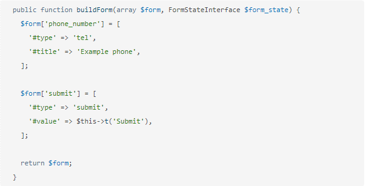

# Drupal Form

## Drupal Form

### 1.Tạo Form

public function buildForm\(array $form, FormStateInterface $form\_state\)

This returns a Form API array that defines each of the elements your form is composed of.

Ví dụ về tạo form:

### 2.Validate form

Để thực hiện validate form trong drupal sử phương thức validateForm từ implementation \Drupal\Core\Form\FormStateInterface

Các giá trị do người dùng gửi từ biểu mẫu được chứa trong $form\_state

Khi một form được gửi, Drupal chạy qua tất cả các trình xử lý xác thực cho form,cả trình xử lý xác thực mặc định và bất kỳ trình xử lý xác thực nào được thêm bởi các nhà phát triển.

Nếu có bất kỳ lỗi nào, HTML cho form được xây dựng lại, thông báo lỗi được hiển thị và các trường có lỗi được bôi đen.

Điều này cho phép người dùng sửa bất kỳ lỗi nào và gửi lại form.

Nếu không có lỗi, trình xử lý trình form được thực thi.

Ví dụ về validate form:

### 3.Submit form

Để thực hiện điều này với Form API của Drupal,chúng ta cần triển khai phương thức submitForm từ trong implementation \Drupal\Core\Form\FormInterface

Ví dụ:

### 4.Retrieving form

FormBuilder có thể được sử dụng để truy xuất và xử lý các form

Đối số được truyền cho phương thức getForm \(\) là tên của lớp xác định form và là một implementation của \Drupal\Core\Form\FormInterface

Ví dụ:

### 5.Altering form

Sử dụng hook\_form\_alter\(\) hoặc hook\_form\_FORM\_ID\_alter\(\) để thay đổi form

Ví dụ:

